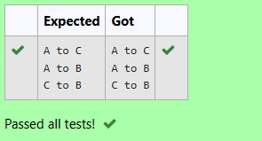

# Tower Of Hanoi Problem
## Aim
Write a C program to implement the Tower of Hanoi problem using recursion. The number of disks is 2. Use the peg names A, B, and C. Display all the moves of the disks as output.

## Algorithm
If there is only 1 disk, move it from the source peg to the destination peg and print the move.

Otherwise, move n-1 disks from the source peg to the auxiliary peg using the destination peg.

Move the nth disk from the source peg to the destination peg and print the move.

Move the n-1 disks from the auxiliary peg to the destination peg using the source peg.

Repeat recursively until all disks are moved.

## Program
```
#include <stdio.h>

// Function to solve Tower of Hanoi
void towerOfHanoi(int n, char from, char to, char aux) {
    if (n == 1) {
        printf("%c to %c\n", from, to);
        return;
    }
    towerOfHanoi(n - 1, from, aux, to);
    printf("%c to %c\n", from, to);
    towerOfHanoi(n - 1, aux, to, from);
}

int main() {
    int n = 2; // Number of disks
    towerOfHanoi(n, 'A', 'B', 'C');
    return 0;
}

```
## Output

## Result
The program successfully displays all the steps required to move 2 disks from peg A to peg B using peg C according to the Tower of Hanoi rules.